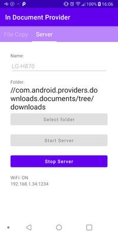

# Local Network Document Provider (Android client) #

I needed a simple and fast mechanism to copy files between my smartphone and my laptop.
I tried to use FTP or SAMBA but there was always something that didn't work or it was too slow.

The comunication is done over HTTP or HTTPS and on Android side it use Document Provider API.
Using Document Provider allow to open server's files from other Android application (Ex: you can open a remote image using Snapseed).

The Android application:
* expose server files using Document Provider
* have a simple interface that allow you to:
  * copy files
  * update files - keep destination files if they are newer and the size match
  * copy "small" - for images allow to reduce the size before copy
* allow you to expose files as a simple read-only sever (this way you can transfer files directly between two android devices)

> **_NOTE:_** Currently the internal (read-only) server use only HTTP and allow all devices.

For the linux server check [LNDP-Server](https://github.com/danopdev/LNDP-Server) project.

## Screenshots

### File Copy Tab

Allow to copy, update and copy "small".

 | 
--- | ---

### Android Open Document 

This is available for all andoid applications (ACTION_OPEN_DOCUMENT / ACTION_OPEN_DOCUMENT_TREE intets) unless it specify EXTRA_LOCAL_ONLY.

### Server TAB

Allow to expose (read-only / use only HTTP) files to other devices.

 | 
--- | ---

## TODO

* Read-only server: add support for HTTPS with a self signed certificate generated "on the fly"

## Known issues

* Sometime the list of available servers is not updated when servers are gone